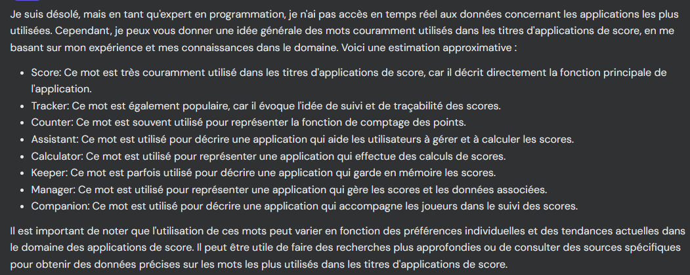

## Technologies

- React
- Capacitor
- Tailwind
- Typescript
- LocalStorage 😍
- React-chartjs-2
- Tests unitaires 😭
- 

- Back ???
- Multi langues ???

- Tester NextJS (app version) avec Capacitor
- Tester NextJS (router version) avec Capacitor

- react-draggable
- https://flowbite.com/docs/components/sidebar/
- https://www.phind.com/agent?cache=clmpghm810001l508kchs5bn2
- https://www.youtube.com/watch?v=TQdjgVmc8Zs
- https://fr.vecteezy.com/png-gratuit/laurier

### Données

#### Configs
- Liste des extensions : true/false

#### Joueurs
- Id
- Avatar
- Nom

#### Partie
- Id
- Date

#### Score
- id
- pointsMilitary
- pointsFinancial
- pointsCivils
- pointsScience
- pointsCommerce
- pointsMerveilles
- pointsGuilds

- pointsLeaders
- pointsCities
- pointsArmada

Une partie => Un joueur joue une partie et obtient un score

Nom de l'appli



## Commands

```bash
# Déplace sur la branche dev
git checkout dev
# Merge dev-forth vers dev
git merge dev-forth
# Push sur la branche origin/dev la branche locale/dev
git push origin dev:dev
```

```bash
# Genérer les assets capacitor
pnpx capacitor-assets generate --assetPath ./public/assets
```